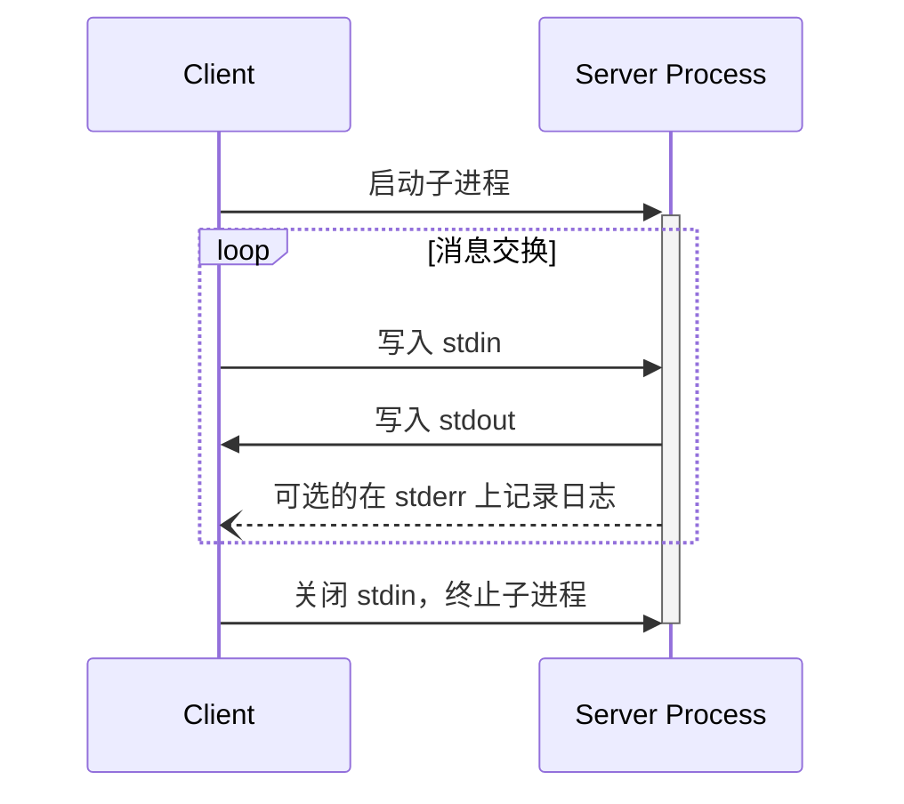
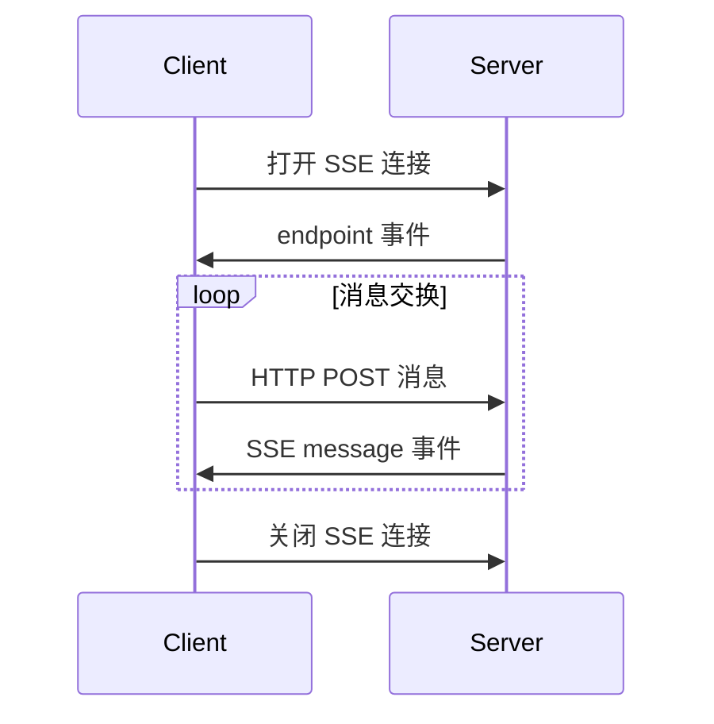

 **协议版本**：


MCP 目前定义了两种标准传输机制用于客户端-服务器通信：

1. [stdio](#stdio)，通过标准输入和标准输出进行通信
2. [带有服务器发送事件的 HTTP](#http-with-sse) (SSE)

客户端在可能的情况下**应该**支持 stdio。

客户端和服务器也可以以可插拔的方式实现[自定义传输](#custom-transports)。

## stdio

在 **stdio** 传输中：

- 客户端将 MCP 服务器作为子进程启动。
- 服务器在其标准输入（`stdin`）上接收 JSON-RPC 消息，并将响应写入其标准输出（`stdout`）。
- 消息由换行符分隔，并且**不得**包含嵌入的换行符。
- 服务器**可以**将 UTF-8 字符串写入其标准错误（`stderr`）用于日志记录。客户端**可以**捕获、转发或忽略此日志。
- 服务器**不得**向其 `stdout` 写入任何不是有效 MCP 消息的内容。
- 客户端**不得**向服务器的 `stdin` 写入任何不是有效 MCP 消息的内容。

## HTTP with SSE

在 **SSE** 传输中，服务器作为一个独立的进程运行，可以处理多个客户端连接。

服务器**必须**提供两个端点：

1. 一个 SSE 端点，供客户端建立连接并接收来自服务器的消息
2. 一个常规的 HTTP POST 端点，供客户端向服务器发送消息

当客户端连接时，服务器**必须**发送一个包含客户端用于发送消息的 URI 的 `endpoint` 事件。所有后续的客户端消息**必须**作为 HTTP POST 请求发送到此端点。

服务器消息作为 SSE `message` 事件发送，消息内容在事件数据中编码为 JSON。

## 自定义传输

客户端和服务器**可以**实现额外的自定义传输机制以满足其特定需求。该协议与传输无关，可以在任何支持双向消息交换的通信通道上实现。

选择支持自定义传输的实现者**必须**确保它们保留 MCP 定义的 JSON-RPC 消息格式和生命周期要求。自定义传输**应该**记录其特定的连接建立和消息交换模式，以帮助互操作性。