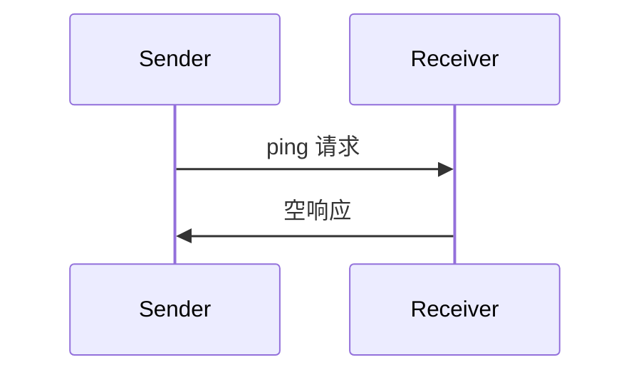

 **协议版本**：


模型上下文协议包括一个可选的 ping 机制，允许任何一方验证其对应方仍然有响应且连接处于活动状态。

## 概述

ping 功能通过简单的请求/响应模式实现。客户端或服务器都可以通过发送 `ping` 请求来启动 ping。

## 消息格式

ping 请求是一个没有参数的标准 JSON-RPC 请求：

```json
{
  "jsonrpc": "2.0",
  "id": "123",
  "method": "ping"
}
```

## 行为要求

1. 接收者**必须**及时响应一个空响应：

```json
{
  "jsonrpc": "2.0",
  "id": "123",
  "result": {}
}
```

2. 如果在合理的超时期内没有收到响应，发送者**可以**：
   - 认为连接已过期
   - 终止连接
   - 尝试重新连接程序

## 使用模式



## 实现考虑

- 实现**应该**定期发出 ping 以检测连接健康状况
- ping 的频率**应该**是可配置的
- 超时**应该**适合网络环境
- **应该**避免过度 ping 以减少网络开销

## 错误处理

- 超时**应该**被视为连接失败
- 多次 ping 失败**可能**触发连接重置
- 实现**应该**记录 ping 失败以进行诊断