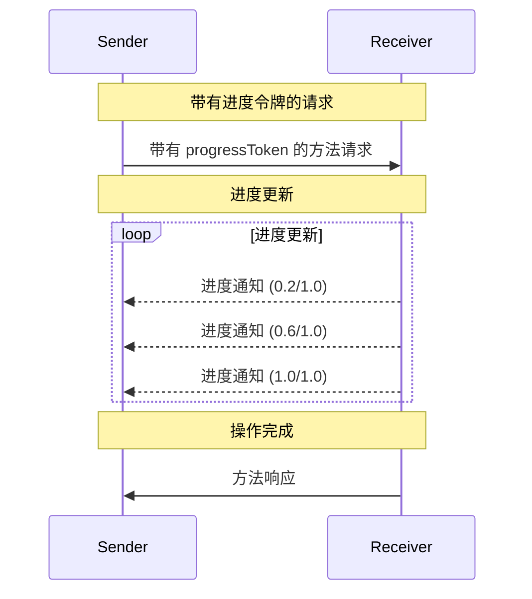

 **协议版本**：


模型上下文协议（MCP）通过通知消息支持对长时间运行的操作进行可选的进度跟踪。任何一方都可以发送进度通知，提供关于操作状态的更新。

## 进度流程

当一方想要_接收_请求的进度更新时，它在请求元数据中包含一个 `progressToken`。

- 进度令牌**必须**是字符串或整数值
- 进度令牌可以由发送者使用任何方式选择，但**必须**在所有活动请求中唯一。

```json
{
  "jsonrpc": "2.0",
  "id": 1,
  "method": "some_method",
  "params": {
    "_meta": {
      "progressToken": "abc123"
    }
  }
}
```

接收者**可以**然后发送包含以下内容的进度通知：

- 原始进度令牌
- 目前为止的当前进度值
- 可选的"总计"值

```json
{
  "jsonrpc": "2.0",
  "method": "notifications/progress",
  "params": {
    "progressToken": "abc123",
    "progress": 50,
    "total": 100
  }
}
```

- `progress` 值**必须**随着每个通知增加，即使总计未知。
- `progress` 和 `total` 值**可以**是浮点数。

## 行为要求

1. 进度通知**必须**只引用以下令牌：

   - 在活动请求中提供的
   - 与正在进行的操作相关联的

2. 进度请求的接收者**可以**：
   - 选择不发送任何进度通知
   - 以他们认为适当的频率发送通知
   - 如果未知则省略总计值



## 实现说明

- 发送者和接收者**应该**跟踪活动的进度令牌
- 双方**应该**实现速率限制以防止泛滥
- 完成后**必须**停止进度通知