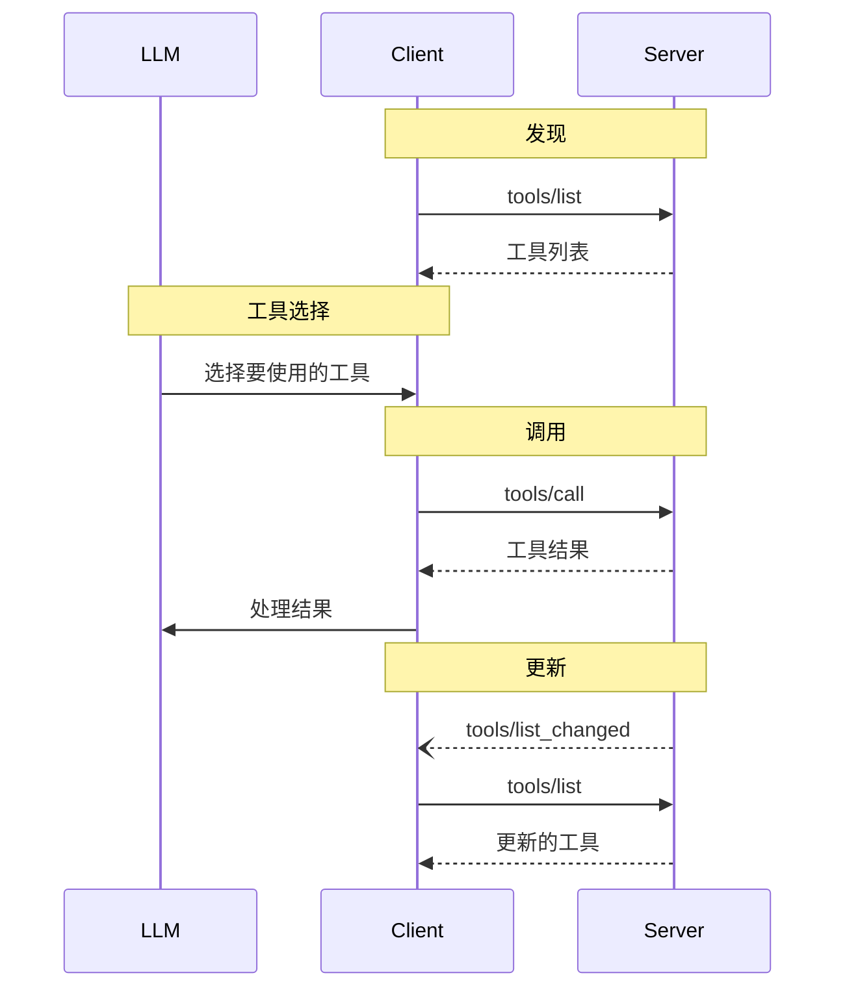

 **协议版本**：


模型上下文协议（MCP）允许服务器公开可由语言模型调用的工具。工具使模型能够与外部系统交互，例如查询数据库、调用 API 或执行计算。每个工具都由名称唯一标识，并包含描述其模式的元数据。

## 用户交互模型

MCP 中的工具被设计为**模型控制**的，这意味着语言模型可以根据其上下文理解和用户的提示自动发现和调用工具。

然而，实现可以通过任何适合其需求的界面模式公开工具&mdash;协议本身不要求任何特定的用户交互模型。

 出于信任、安全和安全考虑，**应该**始终有一个人在循环中，能够拒绝工具调用。

应用程序**应该**：

- 提供清晰显示哪些工具暴露给 AI 模型的 UI
- 在调用工具时插入清晰的视觉指示器
- 向用户呈现操作确认提示，以确保有人参与其中 

## 能力

支持工具的服务器**必须**声明 `tools` 能力：

```json
{
  "capabilities": {
    "tools": {
      "listChanged": true
    }
  }
}
```

`listChanged` 表示服务器是否会在可用工具列表更改时发出通知。

## 协议消息

### 列出工具

要发现可用工具，客户端发送 `tools/list` 请求。此操作支持[分页]()。

**请求：**

```json
{
  "jsonrpc": "2.0",
  "id": 1,
  "method": "tools/list",
  "params": {
    "cursor": "可选的光标值"
  }
}
```

**响应：**

```json
{
  "jsonrpc": "2.0",
  "id": 1,
  "result": {
    "tools": [
      {
        "name": "get_weather",
        "description": "获取位置的当前天气信息",
        "inputSchema": {
          "type": "object",
          "properties": {
            "location": {
              "type": "string",
              "description": "城市名称或邮政编码"
            }
          },
          "required": ["location"]
        }
      }
    ],
    "nextCursor": "下一页光标"
  }
}
```

### 调用工具

要调用工具，客户端发送 `tools/call` 请求：

**请求：**

```json
{
  "jsonrpc": "2.0",
  "id": 2,
  "method": "tools/call",
  "params": {
    "name": "get_weather",
    "arguments": {
      "location": "纽约"
    }
  }
}
```

**响应：**

```json
{
  "jsonrpc": "2.0",
  "id": 2,
  "result": {
    "content": [
      {
        "type": "text",
        "text": "纽约当前天气：\n温度：72°F\n天气状况：局部多云"
      }
    ],
    "isError": false
  }
}
```

### 列表更改通知

当可用工具列表更改时，声明了 `listChanged` 能力的服务器**应该**发送通知：

```json
{
  "jsonrpc": "2.0",
  "method": "notifications/tools/list_changed"
}
```

## 消息流



## 数据类型

### 工具

工具定义包括：

- `name`：工具的唯一标识符
- `description`：功能的人类可读描述
- `inputSchema`：定义预期参数的 JSON Schema

### 工具结果

工具结果可以包含不同类型的多个内容项：

#### 文本内容

```json
{
  "type": "text",
  "text": "工具结果文本"
}
```

#### 图像内容

```json
{
  "type": "image",
  "data": "base64-编码的数据",
  "mimeType": "image/png"
}
```

#### 嵌入资源

[资源]() **可以**被嵌入，以提供额外的上下文或数据，通过客户端以后可以订阅或再次获取的 URI：

```json
{
  "type": "resource",
  "resource": {
    "uri": "resource://example",
    "mimeType": "text/plain",
    "text": "资源内容"
  }
}
```

## 错误处理

工具使用两种错误报告机制：

1. **协议错误**：用于以下问题的标准 JSON-RPC 错误：

   - 未知工具
   - 无效参数
   - 服务器错误

2. **工具执行错误**：在带有 `isError: true` 的工具结果中报告：
   - API 失败
   - 无效输入数据
   - 业务逻辑错误

协议错误示例：

```json
{
  "jsonrpc": "2.0",
  "id": 3,
  "error": {
    "code": -32602,
    "message": "未知工具：invalid_tool_name"
  }
}
```

工具执行错误示例：

```json
{
  "jsonrpc": "2.0",
  "id": 4,
  "result": {
    "content": [
      {
        "type": "text",
        "text": "获取天气数据失败：API 速率限制已超出"
      }
    ],
    "isError": true
  }
}
```

## 安全考虑

1. 服务器**必须**：

   - 验证所有工具输入
   - 实现适当的访问控制
   - 对工具调用进行速率限制
   - 清理工具输出

2. 客户端**应该**：
   - 对敏感操作提示用户确认
   - 在调用服务器之前向用户显示工具输入，以避免恶意或意外的数据泄露
   - 在传递给 LLM 之前验证工具结果
   - 为工具调用实现超时
   - 记录工具使用情况以便审计