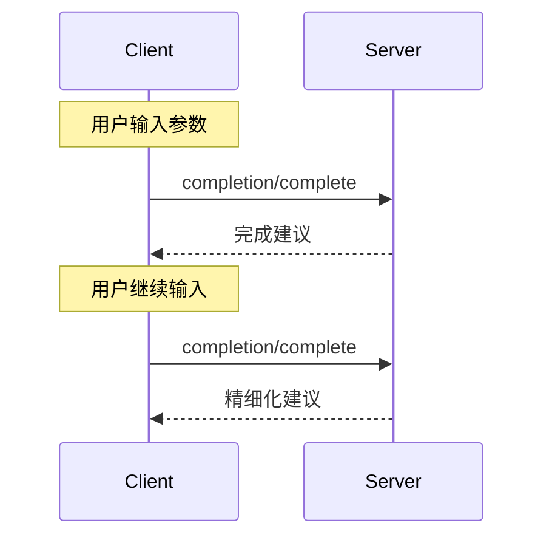

 **协议版本**：


模型上下文协议（MCP）为服务器提供了一种标准化方式，用于为提示和资源 URI 提供参数自动完成建议。这使得用户在输入参数值时能够获得类似 IDE 的丰富体验，接收上下文建议。

## 用户交互模型

MCP 中的自动完成旨在支持类似 IDE 代码完成的交互式用户体验。

例如，应用程序可能在用户输入时在下拉菜单或弹出菜单中显示完成建议，用户可以从可用选项中筛选和选择。

然而，实现可以通过任何适合其需求的界面模式公开自动完成&mdash;协议本身不要求任何特定的用户交互模型。

## 协议消息

### 请求完成

要获取完成建议，客户端发送 `completion/complete` 请求，通过引用类型指定正在完成的内容：

**请求：**

```json
{
  "jsonrpc": "2.0",
  "id": 1,
  "method": "completion/complete",
  "params": {
    "ref": {
      "type": "ref/prompt",
      "name": "code_review"
    },
    "argument": {
      "name": "language",
      "value": "py"
    }
  }
}
```

**响应：**

```json
{
  "jsonrpc": "2.0",
  "id": 1,
  "result": {
    "completion": {
      "values": ["python", "pytorch", "pyside"],
      "total": 10,
      "hasMore": true
    }
  }
}
```

### 引用类型

协议支持两种类型的完成引用：

| 类型           | 描述                 | 示例                                             |
| -------------- | -------------------- | ------------------------------------------------ |
| `ref/prompt`   | 按名称引用提示       | `{"type": "ref/prompt", "name": "code_review"}`  |
| `ref/resource` | 引用资源 URI         | `{"type": "ref/resource", "uri": "file:///{path}"}` |

### 完成结果

服务器返回按相关性排序的完成值数组，包含：

- 每个响应最多 100 个项目
- 可选的可用匹配总数
- 指示是否存在额外结果的布尔值

## 消息流



## 数据类型

### CompleteRequest

- `ref`：`PromptReference` 或 `ResourceReference`
- `argument`：包含以下内容的对象：
  - `name`：参数名称
  - `value`：当前值

### CompleteResult

- `completion`：包含以下内容的对象：
  - `values`：建议数组（最多 100 个）
  - `total`：可选的匹配总数
  - `hasMore`：额外结果标志

## 实现考虑

1. 服务器**应该**：

   - 按相关性返回建议
   - 在适当情况下实现模糊匹配
   - 对完成请求进行速率限制
   - 验证所有输入

2. 客户端**应该**：
   - 防抖快速完成请求
   - 在适当情况下缓存完成结果
   - 优雅地处理缺失或部分结果

## 安全

实现**必须**：

- 验证所有完成输入
- 实施适当的速率限制
- 控制对敏感建议的访问
- 防止基于完成的信息泄露